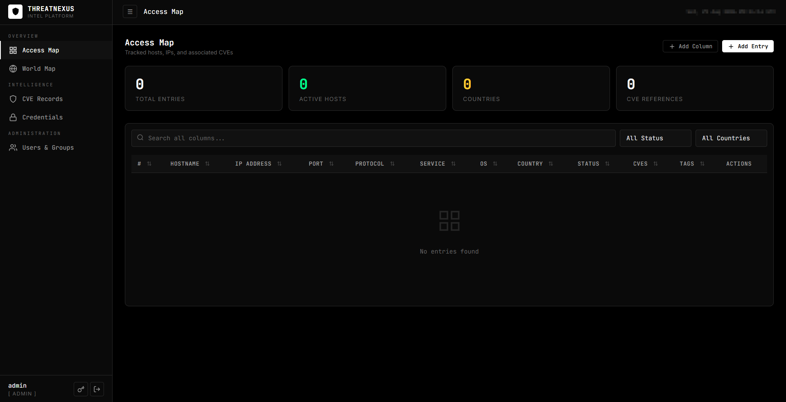
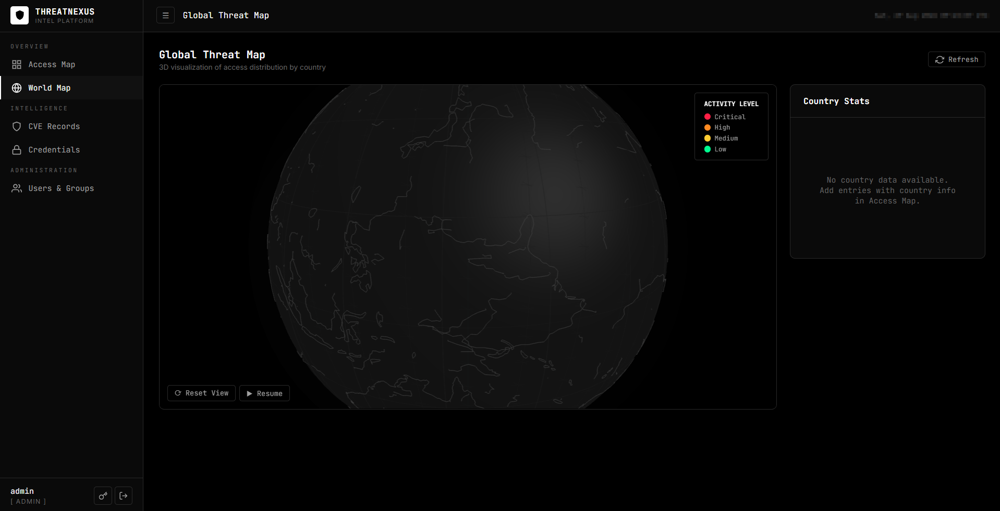

# ThreatNexus

A compact, self-contained threat intelligence and CVE management platform built with Python/Flask. Track vulnerabilities, manage credentials, map hosts, and visualize threat data on an interactive 3D globe — all from a single script with zero external database requirements.

> **Version:** 1.0 | **Author:** EynaExp

---

### Access Map



### Global Threat Map



---

## Features

| Feature | Description |
|---------|-------------|
| **CVE Records** | Track CVEs with severity, type (RCE/LPE/SQLi/XSS/...), PoC code, references, and country targeting |
| **Access Map** | Map hosts/IPs with associated CVEs, services, OS details, notes, and country data |
| **3D World Globe** | Interactive rotating globe with country-level heatmap, click-to-filter |
| **Credential Manager** | Store SSH, RDP, FortiGate, SMB, and custom service credentials |
| **Users & Groups** | Admin creates users with multiple group assignments |
| **Group-based Access Control** | Users only see data assigned to their groups |
| **Password Management** | Users can change their own passwords |

## Tech Stack

- **Backend:** Python 3.8+ / Flask
- **Frontend:** Vanilla JavaScript SPA (served by Flask)
- **3D Globe:** Three.js (loaded from CDN)
- **Data Storage:** JSON file (auto-created, no database required)
- **Auth:** PBKDF2-SHA256 password hashing (600K rounds), Flask sessions with HttpOnly cookies

## Quick Start

```bash
# Clone the repository
git clone https://github.com/EynaExp/ThreatNexus.git
cd ThreatNexus/threat_intel_app

# Make scripts executable
chmod +x start.sh stop.sh restart.sh

# Start on default port 5000
./start.sh

# Or start on a custom port
./start.sh 8080
```

Open **http://localhost:5000** in your browser. On first boot, you'll be prompted to create the admin account — this is the only time setup can be done.

## Prerequisites

- Python 3.8 or higher
- Bash (for start/stop scripts)
- Internet connection on first run (for globe GeoJSON data)

## Configuration

The application can be configured via environment variables or script arguments:

| Environment Variable | Default | Description |
|---------------------|---------|-------------|
| `PORT` | `5000` | HTTP port to listen on |
| `DATA_FILE` | `./data/threat_intel.json` | Path to JSON data storage file |
| `SECRET_KEY` | Auto-generated | Flask session secret key |
| `SESSION_TIMEOUT` | `3600` | Session timeout in seconds |
| `DEBUG` | `false` | Enable Flask debug mode |

### Script Arguments

| Script | Arg 1 | Arg 2 | Arg 3 |
|--------|-------|-------|-------|
| `start.sh` | PORT (default: 5000) | DATA_FILE (default: `./data/threat_intel.json`) | DEBUG (default: false) |
| `restart.sh` | Same as start.sh | | |
| `stop.sh` | — | | |

### Examples

```bash
# Start on port 8080 with custom data file
./start.sh 8080 /opt/data/intel.json

# Restart on port 9000
./restart.sh 9000

# Stop the application
./stop.sh
```

## Project Structure

```
ThreatNexus/
├── .gitignore
├── index.html                    # React/Vite setup guide (landing page)
├── package.json                  # Node.js dependencies
├── src/                          # React/Vite landing page source
│   ├── App.tsx
│   ├── index.css
│   ├── main.tsx
│   └── utils/
└── threat_intel_app/             # Main application
    ├── app.py                    # Flask API server
    ├── requirements.txt          # Python dependencies
    ├── start.sh                  # Start script
    ├── stop.sh                   # Stop script
    ├── restart.sh                # Restart script
    ├── templates/
    │   └── index.html            # SPA template
    ├── static/
    │   └── app.js                # Frontend JavaScript
    ├── data/                     # (auto-created at runtime)
    │   └── threat_intel.json     # All application data
    ├── .venv/                    # (auto-created) Python virtualenv
    ├── .secret_key               # (auto-generated) Flask session key
    └── threatnexus.log           # (auto-created) Application logs
```

## Security

- **Password Hashing:** PBKDF2-SHA256 with 600,000 iterations
- **Session Security:** HttpOnly, SameSite=Lax cookies
- **Input Sanitization:** HTML escaping on all user input
- **Content Security Policy:** Strict CSP headers enforced
- **XSS Protection:** X-XSS-Protection header + CSP
- **Clickjacking:** X-Frame-Options: DENY
- **Data Isolation:** Group-based access control
- **One-time Setup:** Admin account created only on first boot

### Sensitive Files

The following files are generated at runtime and are **excluded from version control** via `.gitignore`:

| File | Sensitivity | Description |
|------|-------------|-------------|
| `data/threat_intel.json` | **Critical** | Contains all data including password hashes and service credentials |
| `.secret_key` | **High** | Flask session secret key |
| `threatnexus.log` | **Medium** | Application logs |

## First Boot

1. Start the application with `./start.sh`
2. Open `http://localhost:5000` in your browser
3. You'll be prompted to create the admin account
4. After creation, normal login applies
5. Create additional users and groups from the admin panel

## License

All rights reserved. No license is granted for use, modification, or distribution without explicit permission from the author.

## Author

**EynaExp** — [GitHub](https://github.com/EynaExp)
